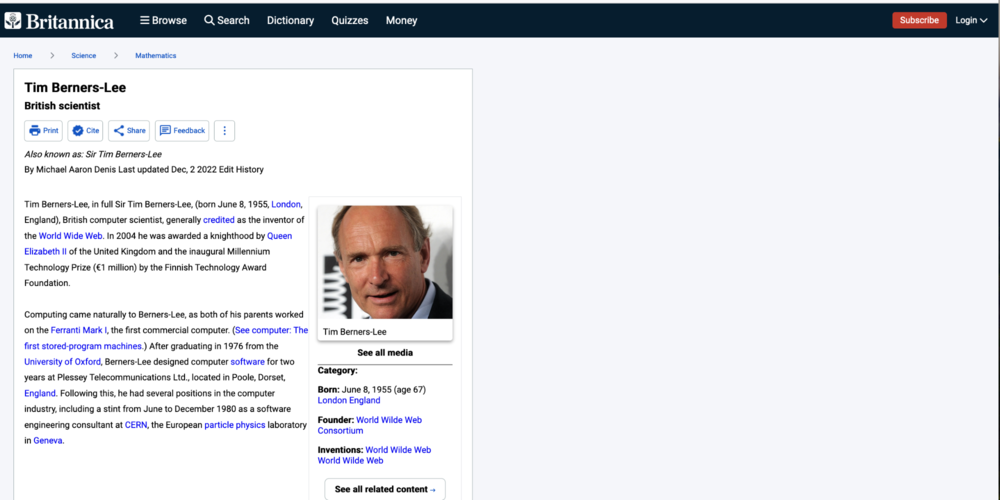

# Tim Berners-lee

A simple web page on Tim Berners-Lee, following a predefined mockup. 

## Mobile version

## Desktop version

## See it live
Click here to see the [live version](https://yannick2019.github.io/tim-berners-lee/) 

## Technologies used
- vite ompiler
-  HTML5
- CSS

## develop
1. git clone project
2. pnpm install # or npm install # or yarn to install dependencies
3. pnpm run start # or npm start # or yarn ... to start developing
